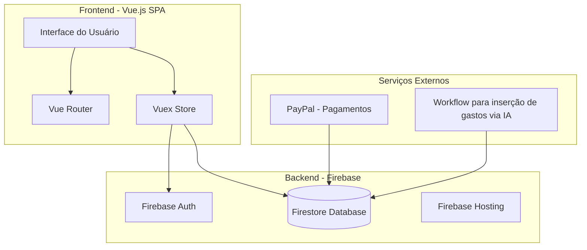
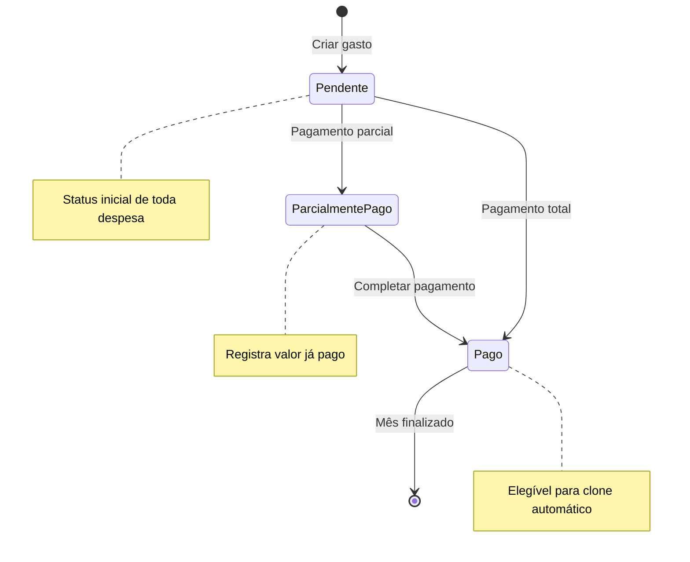
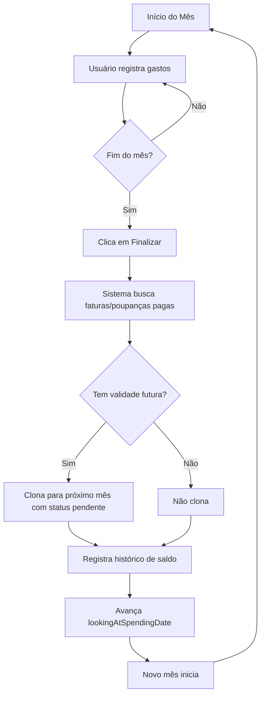
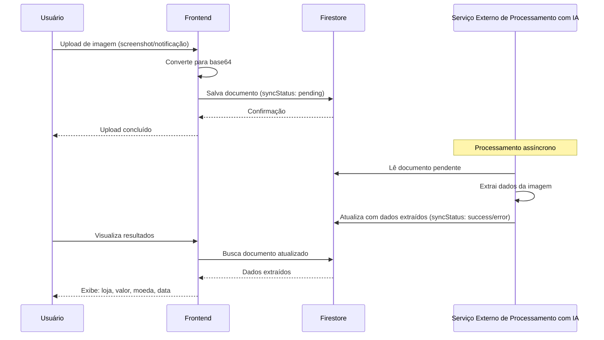
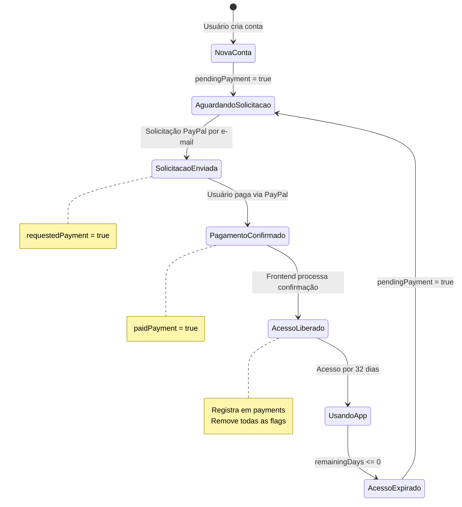
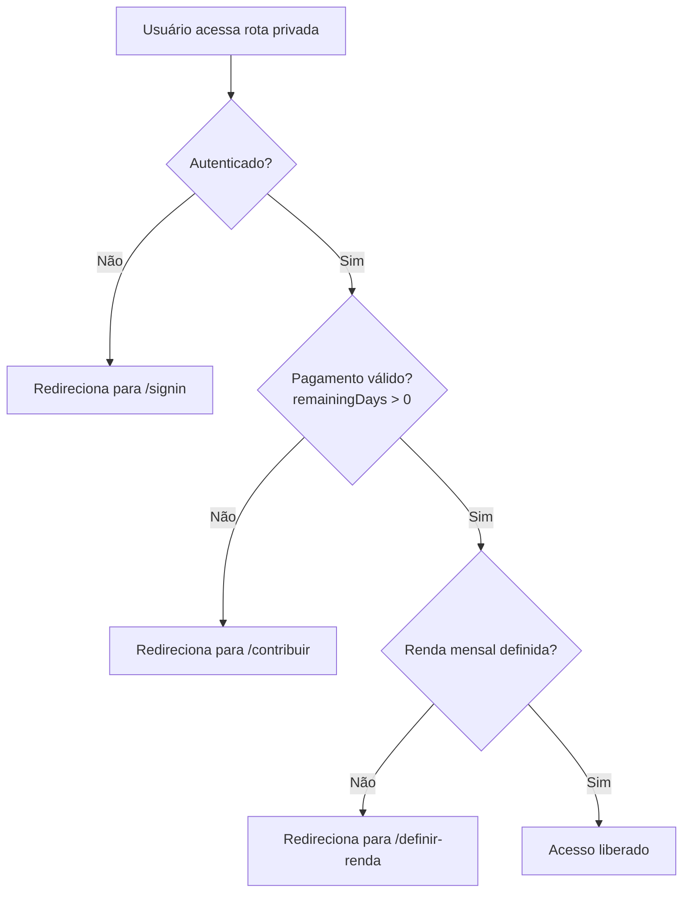
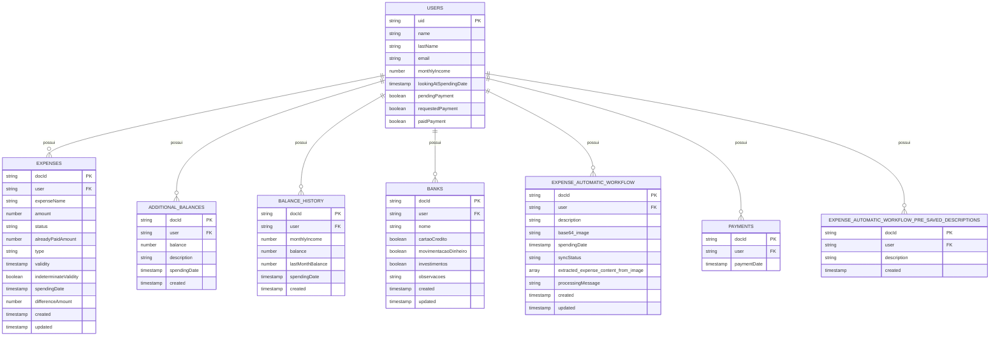

# por.cool

Aplicação web para gerenciamento financeiro pessoal com controle de gastos, saldos, instituições financeiras e workflow para inserção de gastos com IA.

## Sumário

- [Visão Geral](#visão-geral)
- [Regras de Negócio](#regras-de-negócio)
- [Sistema de Assinatura](#sistema-de-assinatura)
- [Modelos de Dados](#modelos-de-dados)
- [Stack Tecnológico](#stack-tecnológico)
- [Configuração do Projeto](#configuração-do-projeto)
- [Licença](#licença)

---

## Visão Geral

O **por.cool** é uma aplicação SPA (Single Page Application) para controle financeiro pessoal que permite:

- Gerenciar gastos mensais com diferentes tipos (gasto único, fatura recorrente, poupança)
- Calcular saldo disponível automaticamente
- Cadastrar bancos e instituições financeiras
- Extrair dados de gastos automaticamente via imagens (IA)
- Acompanhar histórico financeiro mensal



---

## Regras de Negócio

### Gerenciamento de Gastos

#### Estados de uma Despesa



#### Tipos de Despesas

| Tipo | Comportamento |
|------|---------------|
| **Gasto** | Único, apenas no mês atual, não se repete |
| **Fatura** | Recorrente, clonada automaticamente até a data de validade |
| **Poupança** | Similar à fatura, com comportamento de recorrência |

### Ciclo de Mês Financeiro



### Regras de Clone Automático de Despesas

Ao finalizar o mês, o sistema clona automaticamente faturas e poupanças para o próximo mês seguindo estas regras:

| Condição | Clone? |
|----------|--------|
| Tipo = gasto | Não |
| Tipo = fatura/poupança + status = pendente | Não |
| Tipo = fatura/poupança + status = pago + validade < próximo mês | Não |
| Tipo = fatura/poupança + status = pago + validade >= próximo mês | **Sim** |
| Tipo = fatura/poupança + status = pago + validade indeterminada | **Sim** |

### Cálculo de Saldo Disponível

```
Saldo Disponível = Renda Mensal + Saldo Mês Anterior + Saldos Adicionais - Total de Gastos
```

| Componente | Descrição |
|------------|-----------|
| Renda Mensal | Valor fixo definido pelo usuário |
| Saldo Anterior | Sobra do mês anterior (pode ser negativo) |
| Saldos Adicionais | Rendas extras durante o mês |
| Total de Gastos | Soma de todas as despesas do mês |

### Workflow de inserção automática de gastos com IA



**Dados extraídos automaticamente:**
- Nome da loja/estabelecimento
- Valor do gasto
- Moeda (BRL, USD, etc.)
- Data da transação

---

## Sistema de Assinatura

O **por.cool** utiliza um modelo de assinatura mensal com integração PayPal.

### Características

| Item | Valor |
|------|-------|
| Valor da assinatura | R$ 10,00 |
| Período de acesso | 32 dias a partir do pagamento |
| Método de pagamento | PayPal (via solicitação por email) |
| Vínculo | Sem obrigatoriedade de renovação |

### Fluxo Completo de Pagamento



### Estados de Pagamento no Firestore

O sistema utiliza flags no documento do usuário para controlar o estado do pagamento:

| Estado | Flags no documento `users` | Significado |
|--------|---------------------------|-------------|
| Aguardando solicitação | `pendingPayment: true` | Conta criada, aguardando envio de solicitação PayPal |
| Solicitação enviada | `pendingPayment: true`, `requestedPayment: true` | Email com link de pagamento enviado |
| Pagamento confirmado | `requestedPayment: true`, `paidPayment: true` | Pagamento confirmado no PayPal |
| Acesso ativo | Sem flags (removidas) | Pagamento registrado em `payments`, acesso liberado |

### Proteção de Rotas



### Cálculo de Dias Restantes

```javascript
// Fórmula utilizada em src/helpers/payment.js
diasRestantes = 32 - diasDesdeOPagamento
```

| Dias desde pagamento | Dias restantes | Status |
|---------------------|----------------|--------|
| 0 | 32 | Ativo |
| 15 | 17 | Ativo |
| 31 | 1 | Ativo |
| 32 | 0 | **Expirado** |
| 33+ | Negativo | **Expirado** |

---

## Modelos de Dados

### Diagrama Entidade-Relacionamento



### Detalhes das Entidades

#### Users

| Campo | Tipo | Descrição |
|-------|------|-----------|
| `uid` | string | ID único do Firebase Auth |
| `name` | string | Primeiro nome (lowercase) |
| `lastName` | string | Sobrenome (lowercase) |
| `email` | string | Email (lowercase) |
| `monthlyIncome` | number | Renda mensal fixa |
| `lookingAtSpendingDate` | timestamp | Mês/ano sendo visualizado |
| `pendingPayment` | boolean | Flag: aguardando solicitação de pagamento |
| `requestedPayment` | boolean | Flag: solicitação PayPal enviada |
| `paidPayment` | boolean | Flag: pagamento confirmado pelo PayPal |

#### Expenses

| Campo | Tipo | Descrição |
|-------|------|-----------|
| `user` | string | UID do usuário |
| `expenseName` | string | Nome/descrição do gasto |
| `amount` | number | Valor do gasto |
| `status` | enum | `pending`, `partially_paid`, `paid` |
| `alreadyPaidAmount` | number | Valor já pago (para pagamento parcial) |
| `type` | enum | `expense`, `invoice`, `savings` |
| `validity` | timestamp | Data limite para recorrência |
| `indeterminateValidity` | boolean | Recorrência sem fim definido |
| `spendingDate` | timestamp | Mês/ano de referência |
| `differenceAmount` | number | Ajuste no valor original |

#### Payments

| Campo | Tipo | Descrição |
|-------|------|-----------|
| `user` | string | UID do usuário |
| `paymentDate` | timestamp | Data em que o pagamento foi confirmado |

#### Expense Automatic Workflow

| Campo | Tipo | Descrição |
|-------|------|-----------|
| `user` | string | UID do usuário |
| `description` | string | Descrição opcional do upload |
| `base64_image` | string | Imagem codificada em base64 |
| `spendingDate` | timestamp | Data de referência |
| `syncStatus` | enum | `pending`, `success`, `error` |
| `extracted_expense_content_from_image` | array | Dados extraídos pela IA |
| `processingMessage` | string | Feedback do processamento |

---

## Stack Tecnológico

### Frontend

| Tecnologia | Versão | Uso |
|------------|--------|-----|
| Vue.js | 2.6.10 | Framework principal |
| Vue Router | 3.1.3 | Roteamento SPA |
| Vuex | 3.1.2 | Gerenciamento de estado |
| Vuelidate | 0.7.4 | Validação de formulários |
| Buefy | 0.8.0 | UI Framework (Bulma) |

### Backend & Serviços

| Tecnologia | Uso |
|------------|-----|
| Firebase Auth | Autenticação de usuários |
| Firestore | Banco de dados NoSQL |
| Firebase Hosting | Hospedagem da aplicação |
| PayPal | Processamento de pagamentos |

### Utilitários

| Biblioteca | Uso |
|------------|-----|
| Moment.js | Manipulação de datas |
| Lodash | Utilitários JavaScript |
| Decimal.js | Cálculos precisos com decimais |
| v-money | Formatação de moeda |

---

## Configuração do Projeto

### 1. Instalar dependências

```bash
yarn install
```

### 2. Configurar Firebase

Copie o arquivo de exemplo e crie suas configurações de ambiente:

```bash
cp environment.example.js environment.development.js
cp environment.example.js environment.production.js
```

Edite os arquivos com as credenciais do seu projeto Firebase:
- `environment.development.js` - para desenvolvimento/testes
- `environment.production.js` - para produção

### 3. Comandos disponíveis

```bash
# Servidor de desenvolvimento com hot-reload
yarn serve

# Build para produção
yarn build

# Executar testes unitários
yarn test:unit

# Lint e correção automática
yarn lint
```

### 4. Deploy

```bash
# Deploy para ambiente de testes
npm run deploy:test

# Deploy para produção
npm run deploy:production
```

### Ambientes Firebase

| Ambiente | Projeto Firebase |
|----------|------------------|
| default | porcool-tests |
| test | porcool-tests |
| production | porcool |

---

## Licença

Este projeto é open source e está disponível sob a licença [MIT](LICENSE).
